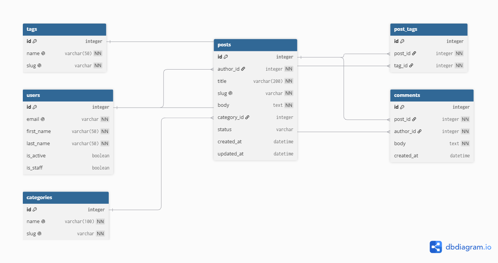

# Blog API

REST API for a blog built with Django REST Framework and JWT authentication.

## ERD



## Setup

```bash
python -m venv venv
venv\Scripts\activate
pip install -r requirements/dev.txt
python manage.py migrate
python manage.py runserver
```

Create `settings/.env` with `BLOG_ENV_ID` and `BLOG_SECRET_KEY`.